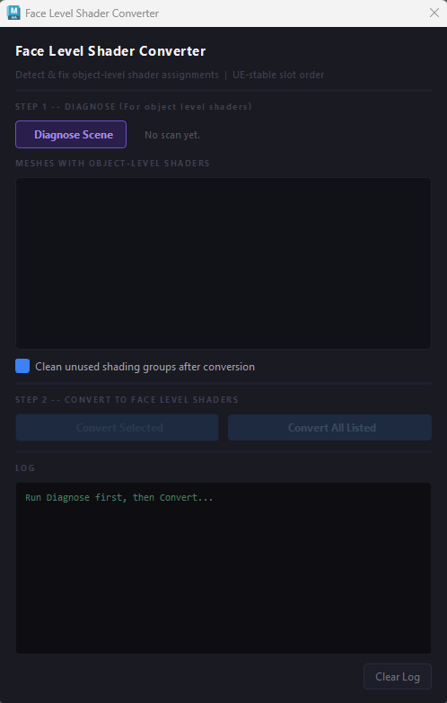
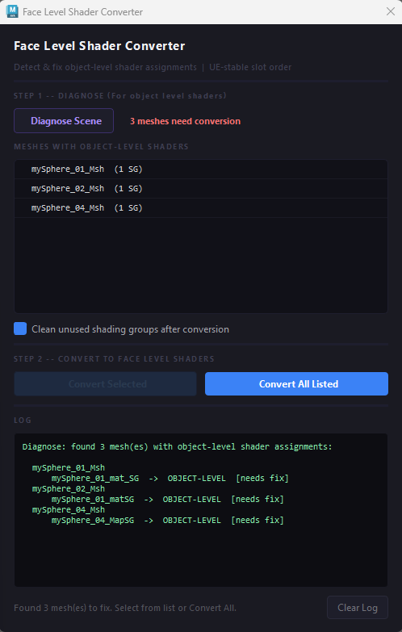
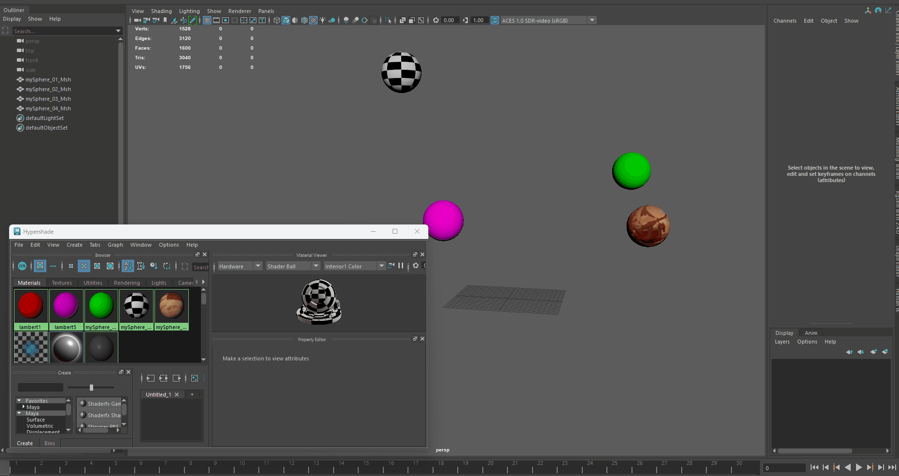
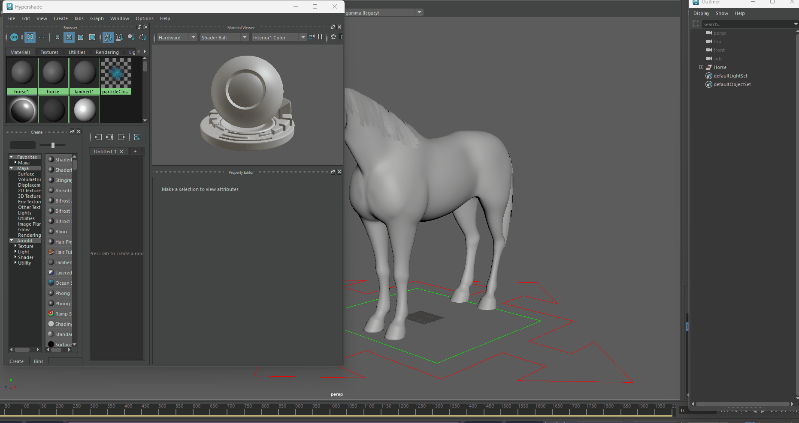

# Maya Face-Level Shader Converter

A Python tool for Autodesk Maya that converts **object-level shader assignments** into **face-level assignments**.

Designed for Technical Artists, Rigging TDs, and Pipeline Developers who want to standardize shader assignments and automate repetitive workflows.

---

## Features

- Convert object-level shader assignments to face-level assignments
- Detect meshes with object-level shader assignments
- Skip meshes that are already correctly assigned
- Optional cleanup of unused shading groups 
- Interactive UI built with PySide2
- Headless Python API for pipeline automation
- Supports processing the entire scene or selected meshes

---

## Why Use It?

Maya allows shaders to be assigned either at the object level or directly on mesh faces. While both approaches are valid, many production pipelines prefer face-level assignments to maintain consistent asset standards and simplify downstream processing.

This tool automates that conversion, eliminating repetitive manual work and making the process consistent across assets.

---

## Demo

### User Interface



### Diagnose Shader Assignments



### Conversion



### Result



---

## Usage

### Launch the UI

```python
import shader_face_converter as sfc

sfc.show_ui()
```

---

### Diagnose the Scene

```python
import shader_face_converter as sfc

sfc.diagnose(selection_only=False)
```

---

### Run Headlessly

```python
import shader_face_converter as sfc

sfc.run_conversion(
    selection_only=False,
    clean_unused=True
)
```

Perfect for:

- Pipeline automation
- Batch processing
- Export tools
- Validation workflows

---

## Typical Workflow

```
Load Scene
      │
      ▼
 Diagnose Shader Assignments
      │
      ▼
Convert Object → Face Assignments
      │
      ▼
Clean Unused Shading Groups (Optional)
      │
      ▼
Pipeline Ready
```

---

## Tech Stack

- Python
- Autodesk Maya
- maya.cmds
- OpenMaya
- OpenMayaUI
- PySide2
- shiboken2

---

## Project Structure

```
face-level-shader-converter/
│
├── shader_face_converter.py
├── README.md
├── LICENSE
└── screenshots/
```

---

## Contributing

Bug reports, feature requests, and pull requests are welcome.

If you find an issue or have an idea for improvement, feel free to open an issue.

---

## License

MIT License

---

## Author

**Prem Kumar Mahato**

Rigging Artist • Technical Artist • Pipeline Developer

Passionate about building tools, automation, and production pipelines for Autodesk Maya and game development.

LinkedIn:
https://www.linkedin.com/in/premkumarmahato/
